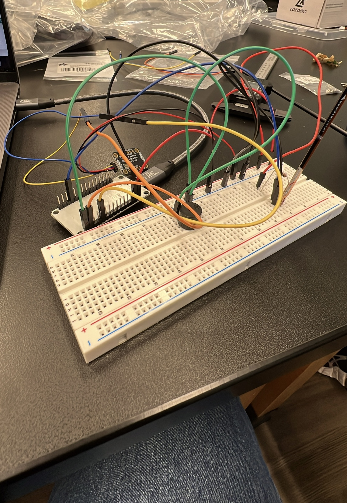
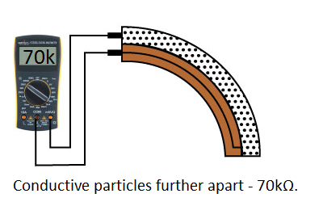
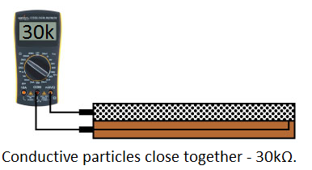
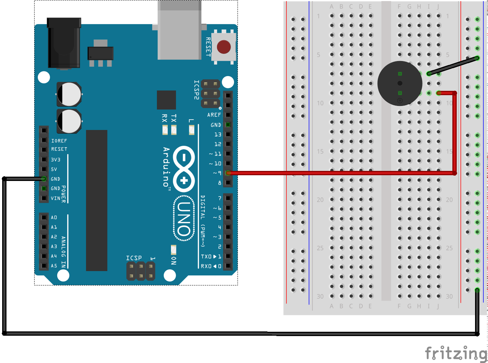
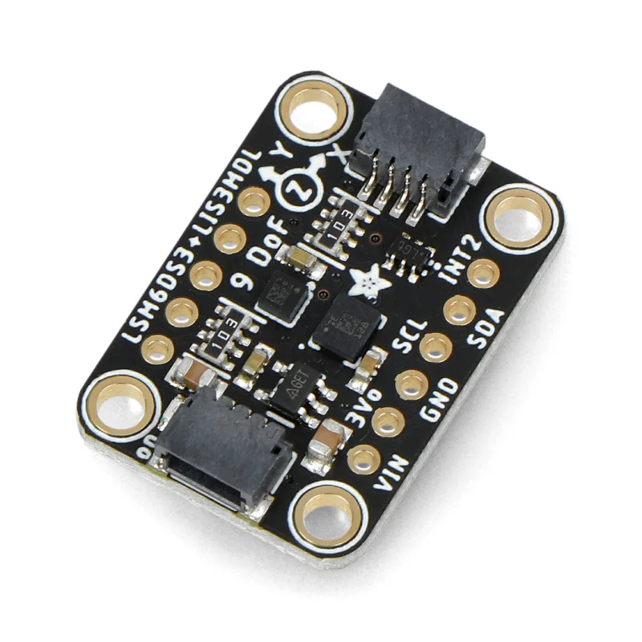
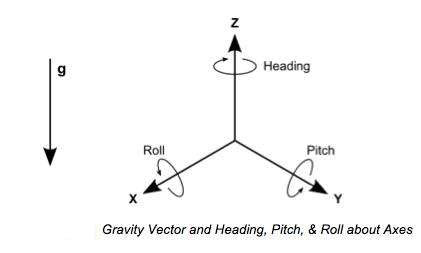
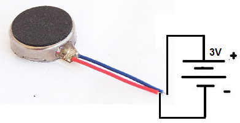
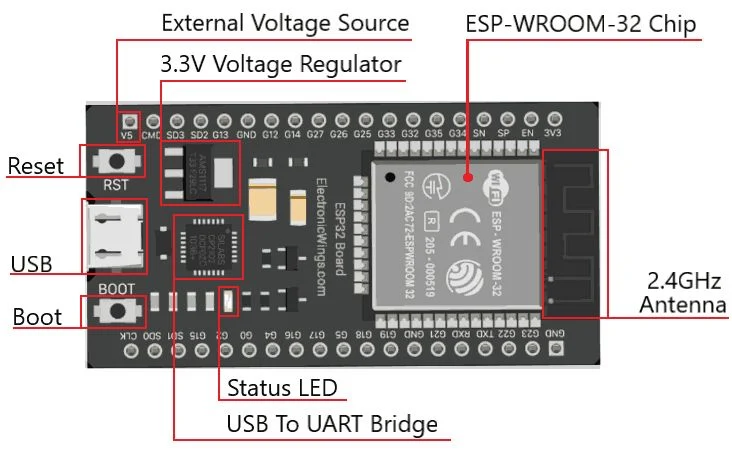

# Wrist Rehabilitation Device
<!--Replace this text with a brief description (2-3 sentences) of your project. This description should draw the reader in and make them interested in what you've built. You can include what the biggest challenges, takeaways, and triumphs from completing the project were. As you complete your portfolio, remember your audience is less familiar than you are with all that your project entails!-->

My project is a wrist rehabilitation device that uses an accelerometer and flex sensor to monitor wrist movements and provide feedback during exercises. By showing data through Bluetooth, it helps track range of motion and exercise repetitions. This device aims to make rehabilitation more engaging and effective.


<!--- You should comment out all portions of your portfolio that you have not completed yet, as well as any instructions:
```HTML 
This is an HTML comment in Markdown 
 Anything between these symbols will not render on the published site -->


| **Engineer** | **School** | **Area of Interest** | **Grade** |
|:--:|:--:|:--:|:--:|
| Samhita M | Irvington High School | Biomedical Engineering | Incoming Junior

<!--**Replace the BlueStamp logo below with an image of yourself and your completed project. Follow the guide [here](https://tomcam.github.io/least-github-pages/adding-images-github-pages-site.html) if you need help.** -->


  
# Final Milestone

<!--- **Don't forget to replace the text below with the embedding for your milestone video. Go to Youtube, click Share -> Embed, and copy and paste the code to replace what's below.**

<iframe width="560" height="315" src="https://www.youtube.com/embed/F7M7imOVGug" title="YouTube video player" frameborder="0" allow="accelerometer; autoplay; clipboard-write; encrypted-media; gyroscope; picture-in-picture; web-share" allowfullscreen></iframe>

For your final milestone, explain the outcome of your project. Key details to include are:
- What you've accomplished since your previous milestone
- What your biggest challenges and triumphs were at BSE
- A summary of key topics you learned about
- What you hope to learn in the future after everything you've learned at BSE -->

<iframe width="560" height="315" src="https://www.youtube.com/embed/ys18oh9p4n8?si=Lgu7BKVFfesgfTTN" title="YouTube video player" frameborder="0" allow="accelerometer; autoplay; clipboard-write; encrypted-media; gyroscope; picture-in-picture; web-share" referrerpolicy="strict-origin-when-cross-origin" allowfullscreen></iframe>


**Description:**
  For my final milestone, I improved my wrist rehabilitation device by adding Bluetooth communication, a rep tracking system, and vibration-based feedback. These changes made the device more interactive and wearable for real-time use. I used the ESP32’s built-in Bluetooth Low Energy (BLE) with the BleSerial library to set up a wireless connection between my device and my phone. Depending on the command the user types — such as "start", "progress", or "stoprep" — the ESP32 switches modes and either sends live sensor data or tracks wrist repetitions. This gives users the ability to see live wrist angles and motion, or just monitor their progress while exercising. The rep counter used X-axis acceleration data from the LSM6DS3 accelerometer to count how many full wrist lifts were done safely. When the X-value went above 4.6, it marked the start of a rep, and when it went below -3.6, it completed the rep. I added logic to make sure reps only counted once per full up-and-down motion. The ESP32 sent the current count to the phone via Bluetooth after each rep. Additionally, I introduced real-time calculations of roll, pitch, and yaw to better understand the wrist’s orientation. These were calculated using the accelerometer and gyroscope data to determine if the wrist was tilted too far in any direction. If the flex angle went over 45°, or if the pitch or roll exceeded safe thresholds (pitch ≥ 25° or ≤ -46°, roll ≥ 35° or ≤ -25°), the device triggered a vibration motor connected to pin 23. This provided discreet, haptic feedback to the user without needing a buzzer.

**Challenges:**
  One of the biggest issues I ran into was with the rep counter. In early versions, every time I performed a single wrist rep, the system would count 4 or 5 reps instead of just one. This happened because the accelerometer data fluctuated rapidly around the threshold, and the code was registering each small movement as a new rep. To fix this, I added a control flag (inRep) to make sure a rep was only counted after a full motion cycle (above 4.6, then below -3.6). This reduced false positives and made the counter much more accurate.
  Another challenge I faced was working with roll, pitch, and yaw. While I successfully calculated the values using sensor fusion, I had trouble getting them to graph properly in the Arduino Serial Plotter. They either didn’t appear at all or showed up inconsistently. This made it difficult to visually analyze the data. I also initially used incorrect thresholds for detecting risky tilt angles, so the vibration motor would either not activate when it should or buzz constantly. I had to adjust the pitch and roll threshold ranges several times based on trial and error and live testing until they gave consistent feedback.

**Next Steps:**
  My next steps include making the device fully wearable by sewing on all components (the ESP32, flex sensor, accelerometer, and vibration motor) onto a wrist sleeve. I also plan to clean and optimize the code, including removing unused variables for better readability. 


# Second Milestone

<!--**Don't forget to replace the text below with the embedding for your milestone video. Go to Youtube, click Share -> Embed, and copy and paste the code to replace what's below.**

<iframe width="560" height="315" src="https://www.youtube.com/embed/y3VAmNlER5Y" title="YouTube video player" frameborder="0" allow="accelerometer; autoplay; clipboard-write; encrypted-media; gyroscope; picture-in-picture; web-share" allowfullscreen></iframe>

For your second milestone, explain what you've worked on since your previous milestone. You can highlight:
- Technical details of what you've accomplished and how they contribute to the final goal
- What has been surprising about the project so far
- Previous challenges you faced that you overcame
- What needs to be completed before your final milestone -->


<iframe width="560" height="315" src="https://www.youtube.com/embed/dAKtcRCgfs4?si=HONM-ibQDgTX6WsO" title="YouTube video player" frameborder="0" allow="accelerometer; autoplay; clipboard-write; encrypted-media; gyroscope; picture-in-picture; web-share" referrerpolicy="strict-origin-when-cross-origin" allowfullscreen></iframe>

**Description:**
  For my second milestone, I focused on finding and testing ranges for the flex sensor and accelerometer to measure wrist movement accurately for my rehabilitation device. I used the analogRead() function to read values from the flex sensor because it outputs analog signals based on how much the sensor is bent. This function converts those signals into numeric values (ranging from 0 to 4095 on the ESP32) using the formula below which is needed for calculations in the code.

```c++
 float angle = (float)(flexValue - flatValue) * 90.0 / (bentValue - flatValue);    // converts angle into degrees 
```

  I programmed the flex sensor to calculate wrist bend angles between 0° and 90°, with flat and fully bent readings of 2000 and 2900, respectively because these were the values I received after multiple tests for ranges. I chose the value of 2450 for the flex sensor because it represents the midpoint (45°) between flat and fully bent positions. The if loop runs continuously and checks to see if the sensor is bent past the value assigned. This ensures the buzzer activates when the wrist bends beyond approximately halfway through its motion range especially before reaching uncomfortable or unsafe positions.
  For the accelerometer, I programmed the system to collect 10 readings from each of the X, Y, and Z axes and calculate the average of each to condense the rough values. I focused only on the X-axis because it most clearly reflected wrist tilt during flexion and extension. Through testing, I found that downward wrist bending usually gave an X-value of around -3.6, while upward movement stayed around 4.6. The buzzer is triggered when the X value goes outside these safe ranges. Together, these components allow the system to track wrist motion precisely and give immediate feedback to guide proper rehab movements.


**Challenges:**
  One of the biggest challenges I faced was getting the flex sensor and accelerometer to work together smoothly. They each react at different speeds, and small mistakes in timing or averaging caused the buzzer to activate incorrectly or not at all. I had to spend time to refine the logic to make both sensors communicate without interference.
  Another challenge was making sure the angle values from the flex sensor actually matched real wrist positions. I manually tested the sensor by measuring my wrist at different bend points and comparing those to the calculated angles in the code. I also had to do research to find threshold values that consistently distinguished safe movements from risky ones. This helped me come up with reliable threshold ranges for both the flex sensor and accelerometer.


**Next steps:**
  My next step is to assemble all the components into a wearable prototype. After assembling, I plan to test the device during wrist exercises to evaluate how accurately it detects motion and provides feedback in real-time. I will observe whether the buzzer alerts at the right times and adjust the calibration ranges if needed to improve accuracy and comfort.


# First Milestone

<iframe width="560" height="315" src="https://www.youtube.com/embed/UymND75sh6g?si=2zHMyf4AibszDAVQ&amp;start=1" title="YouTube video player" frameborder="0" allow="accelerometer; autoplay; clipboard-write; encrypted-media; gyroscope; picture-in-picture; web-share" referrerpolicy="strict-origin-when-cross-origin" allowfullscreen></iframe>

<!-- **Don't forget to replace the text below with the embedding for your milestone video. Go to Youtube, click Share -> Embed, and copy and paste the code to replace what's below.**

<iframe width="560" height="315" src="https://www.youtube.com/embed/CaCazFBhYKs" title="YouTube video player" frameborder="0" allow="accelerometer; autoplay; clipboard-write; encrypted-media; gyroscope; picture-in-picture; web-share" allowfullscreen></iframe> -->

<!-- For your first milestone, describe what your project is and how you plan to build it. You can include:
- An explanation about the different components of your project and how they will all integrate together
- Technical progress you've made so far
- Challenges you're facing and solving in your future milestones
- What your plan is to complete your project --->

**Description:**
For my first milestone, I tested each component individually and figured out how each piece worked. Some of the components I tested were:
- Flex sensor
- Accelerometer
- Buzzer

  The wrist rehab device uses three main components: a flex sensor, an accelerometer, and a buzzer, all connected to a device called the ESP 32. The flex sensor checks how much the wrist is bent. It works by using a basic electrical setup called a voltage divider, which just means the sensor and another resistor split up the power. Ohms law says that V = I x R (voltage = current x resistance) so when the resistance changes, the voltage also changes. The ESP 32 reads that voltage to figure out how much the wrist is bending. Bigger numbers usually mean more bending. The accelerometer is a motion sensor that measures how fast the wrist moves in three directions: left/right (x), up/down (y), and forward/back (z). The code turns the values into angles, like 40 degrees, to show how tilted the wrist is. The buzzer is the part that makes a sound when the wrist bends too much. If bent too much or the sensor value gets too high (in my code i set this value to 2500 or greater), the buzzer buzzes.

**Challenges:**
  The biggest challenge I faced was that the accelerometer's test code wasn't working because the code was for a different type of accelerometer and there wasn't any exisiting code to test it so I had to get multiple parts of code from different areas and put it together. There were also multiple libraries I had to download to run the test code. 

**Next Steps:**
  My next step is to work on milestone 2 which is to work on sensor integration and find ranges. I need to research about the correct and incorrect angles to bend your wrist at and add my information into my flex sensor and accelerator code.

 (figure 1)


# Starter Project


<!--- For your first milestone, describe what your project is and how you plan to build it. You can include: -->
<!--- An explanation about the different components of your project and how they will all integrate together -->
<!--- Technical progress you've made so far -->
<!--- Challenges you're facing and solving in your future milestones -->
<!--- What your plan is to complete your project -->

**Description:**
  This is my starter project. It is a retro arcade console, and the reason I picked this is because I felt like it interested me the most. Basically, once you press the red button to turn it on, you can click the left and right yellow buttons, which change the games. As you can see, there are multiple games you can play. Some games you can play are Tetris, Snake, etc., etc. Some components in this project are, of course, the buttons, the score tracker in the top right, the port for connecting it to a computer, a buzzer, a battery pack, the clear plastic frame, and so much more. 

**Challenge:**
  The biggest challenge I faced was soldering. It was not only tedious but also difficult, as the holes were pretty close to each other, which caused soldered parts to touch. I messed up the soldering for the battery pack, so I had to remove the solder and redo it, but it worked great after that.

**Next Steps:**
My next step is to start on my wrist rehabilitation device. I've set 3 milestones for myself too, which are
  1. Test each component individually (ESP32, buzzer, flex sensors, etc.)
  2. Work on sensor integration and finding ranges
  3. Set up a Bluetooth connection and real-time feedback system with a buzzer
     
I also plan to add some modifications, which include
  1. Add vibration feedback in case the person wants silent updates from the device
  2. Create a progress tracking system that shows updates or improvements over time
  3. Add a small screen that shows live data on the wrist sleeve

<iframe width="560" height="315" src="https://www.youtube.com/embed/rH0NynEeV1s?si=uxwH6TJWs3OIG8ov" title="YouTube video player" frameborder="0" allow="accelerometer; autoplay; clipboard-write; encrypted-media; gyroscope; picture-in-picture; web-share" referrerpolicy="strict-origin-when-cross-origin" allowfullscreen></iframe>

 # Schematics 
<!--Here's where you'll put images of your schematics. [Tinkercad](https://www.tinkercad.com/blog/official-guide-to-tinkercad-circuits) and [Fritzing](https://fritzing.org/learning/) are both great resoruces to create professional schematic diagrams, though BSE recommends Tinkercad becuase it can be done easily and for free in the browser. --->

 (figure 2)
The image above is a schematic I used for my first and second milestone.

 (figure 3)
The image above is a schematic I used for my third milestone.


<!--- # Code
Here's where you'll put your code. The syntax below places it into a block of code. Follow the guide [here]([url](https://www.markdownguide.org/extended-syntax/)) to learn how to customize it to your project needs. -->

**all code from milestone 3:**
```c++
#include <Adafruit_LSM6DS3TRC.h>
#include <BleSerial.h>
#include <MadgwickAHRS.h>
Adafruit_LSM6DS3TRC lsm6ds;
BleSerial BLE; 

float accelXValues[10];
float accelYValues[10];
float accelZValues[10];
const int LED = 2;

int count = 0;
float sumX = 0;
float sumY = 0;
float sumZ = 0;
float avgX = 0;
float avgY = 0;
float avgZ = 0;
const int bentUp = 4.6;                                               // accelerometer value when tilted up
const int bentDown = -5;                                              // accelerometer value when tilted down
const int flexPin = 34;                                               // pin where flex sensor wire is connected
//const int buzzerPin = 23;                                           // pin where buzzer is connected
const int motorPin = 23;
const int flatValue = 2000;                                           //flat value of unbent flex sensor
const int bentValue = 2900;                                           // bent value of bent flex sensor
bool repMode = false;
bool wristUp = false;
int repCount = 0;


String message = "";
String command = "";
bool codeRunning = false;
bool wristRep = false;

Madgwick filter;
unsigned long microsPerReading, microsPrevious;
float accelScale, gyroScale;

void setup(void) {
  Serial.begin(115200);
  BLE.begin("Samhita's values");
  while (!Serial) delay(1);
  //pinMode(buzzerPin, OUTPUT);
  pinMode(motorPin, OUTPUT);
  pinMode(LED,OUTPUT);

  Serial.println("Adafruit LSM6DS Accelerometer Only");

  if (!lsm6ds.begin_I2C()) {
    Serial.println("Failed to find LSM6DS chip");
    while (1) delay(100);
  }

  Serial.println("LSM6DS Found!");
  Serial.println("Waiting for 'start'");
  BLE.println("Waiting for 'start'");
  filter.begin(25);
  microsPerReading = 1000000 / 25;
  microsPrevious = micros();
}

void loop() {
  int gix, giy, giz;
  float ax, ay, az;
  float gx, gy, gz;
  float roll, pitch, yaw;
  unsigned long microsNow;
if (BLE.available()) {
  message = BLE.readStringUntil('\n');
  command = message;

  if (command == "start") {
    if (!codeRunning) {
      if (repMode) { 
      Serial.println("Stopping rep mode before displaying regular values");
      BLE.println("Stopping rep mode before displaying regular values");
      repMode = false;
      }
      Serial.println("starting code...");
      BLE.println("starting code...");
      codeRunning = true;
      
      } else {
      Serial.println("Code already running.");
      BLE.println("Code already running.");
      }
    }

  if (command == "stop") {
    if (codeRunning) {
      Serial.println("stopping code...");
      BLE.println("stopping code...");
      codeRunning = false;
      } else {
      Serial.println("Code is not running.");
      BLE.println("Code is not running.");
      }
    }


  if (command == "progress") {
    if (!repMode) {
      if (codeRunning) { 
      Serial.println("Stopping regular values before entering rep mode.");
      BLE.println("Stopping regular values before entering rep mode.");
      codeRunning = false;
    }
      Serial.println("Entering rep mode.");
      BLE.println("Entering rep mode.");
      repMode = true;
      repCount = 0;
    } else {
      Serial.println("already in rep mode");
      BLE.println("already in rep mode");
    }
  }

  if (command == "stoprep") {
    if (repMode) {
      Serial.println("exiting rep mode... ");
      BLE.println("exiting rep mode... ");
      Serial.print("total reps done: ");
      Serial.print(repCount);
      BLE.print("total reps done: ");
      BLE.print(repCount);
      repMode = false;
    } else {
      Serial.println("not in rep mode right now");
      BLE.println("not in rep mode right now");
    }
  } 
}
  
if (repMode) {
  sensors_event_t accel;
  lsm6ds.getAccelerometerSensor()->getEvent(&accel);

Serial.println(accel.acceleration.x);
  if (accel.acceleration.x >= 4.6) {
    if (!wristUp) {
      wristUp = true;
      repCount++;
      Serial.print("Progress: ");
      Serial.println(repCount);
      BLE.print("Rep Count: ");
      BLE.println(repCount);
      delay(200);
      Serial.println(repMode);
      
    }
  } else if (accel.acceleration.x <= -3.6){
    wristUp = false;
  }


}

  if (codeRunning) {
    sensors_event_t accel;
    lsm6ds.getAccelerometerSensor()->getEvent(&accel);
    Serial.print("  Reading ");                                               // commented to test roll pitch yaw
  Serial.print(count + 1);
  Serial.print(": X = ");
  Serial.print(accel.acceleration.x);                                   // prints the x value reading
  Serial.print(", Y = ");
  Serial.print(accel.acceleration.y);                                   // prints the y value reading
  Serial.print(", Z = ");
  Serial.println(accel.acceleration.z);                                 // prints the z value reading
  BLE.print("  Reading ");
  BLE.print(count + 1);
  BLE.print(": X = ");
  BLE.print(accel.acceleration.x);                                   // prints the x value reading
  BLE.print(", Y = ");
  BLE.print(accel.acceleration.y);                                   // prints the y value reading
  BLE.print(", Z = ");
  BLE.println(accel.acceleration.z);                                 // prints the z value reading


 microsNow = micros();
  if (microsNow - microsPrevious >= microsPerReading) {

  sensors_event_t accel;
  sensors_event_t gyro;
  sensors_event_t temp;
  lsm6ds.getEvent(&accel, &gyro, &temp);

 //convert from raw data to gravity and degrees/second units
    ax = convertRawAcceleration(accel.acceleration.x);
    ay = convertRawAcceleration(accel.acceleration.y);
    az = convertRawAcceleration(accel.acceleration.z);
    gx = convertRawGyro(gyro.gyro.x);
    gy = convertRawGyro(gyro.gyro.y);
    gz = convertRawGyro(gyro.gyro.z);

    // update the filter, which computes orientation
    filter.updateIMU(gx, gy, gz, accel.acceleration.x, accel.acceleration.y, accel.acceleration.z);

    // print the yaw, pitch and roll
    roll = filter.getRoll();
    pitch = filter.getPitch();
    yaw = filter.getYaw();
    Serial.print("pitch: ");
    Serial.print(pitch);
    Serial.print(" roll: ");
    Serial.println(roll);
    // increment previous time, so we keep proper pace
    microsPrevious = microsPrevious + microsPerReading;
  }

  count++;

  sumX += accel.acceleration.x;
  sumY += accel.acceleration.y;
  sumZ += accel.acceleration.z;

  int flexValue =analogRead(flexPin);

  float angle = (float)(flexValue - flatValue) * 90.0 / (bentValue - flatValue);

  angle = constrain(angle, 0, 90);


 Serial.print("Sensor: ");
  Serial.print(flexValue);                                                   // commented to test roll pitch and yaw
  Serial.print("  →  Angle: ");
  Serial.print(angle, 1);
  Serial.println("°");
 BLE.print("Sensor: ");
  BLE.print(flexValue);
  BLE.print("  →  Angle: ");
  BLE.print(angle, 1);
  BLE.println("°");


  if (flexValue >= 2450) {                                      // if bent past ranges, buzzer will buzz
    digitalWrite(motorPin, HIGH);
  } else if (pitch>=25 || pitch<=-46) {
    digitalWrite(motorPin, HIGH);
  } else if (roll>=35 || roll<=-25) {
    digitalWrite(motorPin, HIGH);
  } else {
    digitalWrite(motorPin, LOW);
  }


  if (count == 10) {
    avgX = sumX / 10.0;
    avgY = sumY / 10.0;
    avgZ = sumZ / 10.0;
    Serial.print("average x: ");
    Serial.println(avgX);                                               // prints the average x value from 10 readings
    Serial.print("average y: ");
    Serial.println(avgY);                                               // prints the average y value from 10 readings
    Serial.print("average z: ");
    Serial.println(avgZ);                                               // prints the average z value from 10 readings
    count = 0;
    sumX = 0;                                                           // resets the x,y, and z values to 0 to rerun the code
    sumY = 0;                                                           
    sumZ = 0;                                                           
  }

  }
}


float convertRawAcceleration(float aRaw) {
  return aRaw;
}

float convertRawGyro(float gRaw) {
  
  float g = (gRaw *180)/3.141;//change to degreees!!
  return g;
} 
```

**flex sensor code:**
```c++
const int flexPin = 34;                   // pin where flex sensor wire is connected
const int buzzerPin = 23;                 // pin where buzzer is connected

const int flatValue = 2000;               //flat value of unbent flex sensor
const int bentValue = 2900;   

void setup() {
  Serial.begin(115200);
  pinMode(buzzerPin, OUTPUT);
}

void loop() {
  int flexValue = analogRead(flexPin);

  float angle = (float)(flexValue - flatValue) * 90.0 / (bentValue - flatValue);    // converts angle into degrees 

  angle = constrain(angle, 0, 90);

  if (flexValue >= 2450) {              //if flex sensor is bent past 2450, buzzer will buzz
    digitalWrite(buzzerPin, HIGH);      
  } else {
    digitalWrite(buzzerPin, LOW);      
  }
  delay(20);

  Serial.print("Sensor: ");
  Serial.print(flexValue);
  Serial.print("  →  Angle: ");
  Serial.print(angle, 1);
  Serial.println("°");

  delay(500);
}
```


**accelerometer code:**
```c++
#include <Adafruit_LSM6DS3TRC.h>
Adafruit_LSM6DS3TRC lsm6ds;

int buzzerPin = 23;
float accelXValues[10];
float accelYValues[10];
float accelZValues[10];
int count = 0;
float sumX = 0;
float sumY = 0;
float sumZ = 0;
float avgX = 0;
float avgY = 0;
float avgZ = 0;
const int bentUp = 4.6;                                               // accelerometer value when tilted up
const int bentDown = -7;                                              // accelerometer value when tilted down

void setup(void) {
  Serial.begin(115200);
  while (!Serial) delay(1);
  pinMode(buzzerPin, OUTPUT);
  Serial.println("Adafruit LSM6DS Accelerometer Only");

  if (!lsm6ds.begin_I2C()) {
    Serial.println("Failed to find LSM6DS chip");
    while (1) delay(100);
  }
  Serial.println("LSM6DS Found!");
}

void loop() {
sensors_event_t accel;
lsm6ds.getAccelerometerSensor()->getEvent(&accel);

  Serial.print("Reading ");
  Serial.print(count + 1);
  Serial.print(": X = ");
  Serial.print(accel.acceleration.x);                                   // prints the x value reading
  Serial.print(", Y = ");
  Serial.print(accel.acceleration.y);                                   // prints the y value reading
  Serial.print(", Z = ");
  Serial.println(accel.acceleration.z);                                 // prints the z value reading
  
  count++;

  sumX += accel.acceleration.x;
  sumY += accel.acceleration.y;
  sumZ += accel.acceleration.z;
  
  Serial.print(accel.acceleration.x);
  if (accel.acceleration.x>=bentUp || accel.acceleration.x<=bentDown) {  // if bent past ranges, buzzer will buzz
    digitalWrite(buzzerPin, HIGH);
  } else {
    digitalWrite(buzzerPin, LOW);
  }

  delay(100);

  if (count == 10) {
    avgX = sumX / 10.0;
    avgY = sumY / 10.0;
    avgZ = sumZ / 10.0;
    Serial.print("average x: ");
    Serial.println(avgX);                                               // prints the average x value from 10 readings
    Serial.print("average y: ");
    Serial.println(avgY);                                               // prints the average y value from 10 readings
    Serial.print("average z: ");
    Serial.println(avgZ);                                               // prints the average z value from 10 readings
    count = 0;
    sumX = 0;                                                           // resets the x,y, and z values to 0 to rerun the code
    sumY = 0;                                                           
    sumZ = 0;                                                           
  }
}

```

#How It Works


**Flex Sensor**


 (figure 4)


 (figure 5)

A flex sensor is a sensor that changes its electrical resistance when bent. When the bending angle increases, the resistance also increases. As shown in the pictures, when the flex sensor is bent, it displays around 70k Ohms (figure 4) and when it's straight it shows around 30k Ohms (figure 5). The flex sensor bends in one direction which is away from the side with lines. I used it to detect incorrect wrist positions and provide feedback when the bent angle exceeded the safe limits.

**Buzzer**


 (figure 6)

A buzzer creates a sound by rapidly vibrating a piece within its casing. This vibration generates sound waves that we perceive as a buzz. I used a vibration motor instead of a buzzer because I didn't like the noise and I wanted silent feedback but this piece is useful too.

**Accelerometer**


 (figure 7)


 (figure 8)

The accelerometer I used was an lsm6ds3 accelerometer which has a 3D digital accelerometer and a 3D digital gyroscope. It measures linear acceleration and angular rate along the X, Y, and Z axes (as shown in figure 8). The accelerometer detects changes in motion and orientation, while the gyroscope detects rotational motion. In my project I used it to detect rep count based on wrist tilt. It also monitored wrist form and gave feedback if the wrist was bent out of ranges. 

**Vibration Motor**


 (figure 9)

I used a vibration motor in my device for silent feedback. When powered, the motor spins rapidly. The offset weight causes the motor to wobble or move from side to side as it rotates which causes what we perceive as vibrations. The faster the motor spins, the more intense the vibration. I used it to provide haptic feedback when the wrist was bent incorrectly.

**ESP 32**


 (figure 10)

The ESP32 is a low-power system-on-a-chip microcontroller with integrated Wi-Fi and Bluetooth capabilities. The built-in Wi-Fi and Bluetooth modules enable the ESP32 to connect to networks, communicate with other devices, and access online resources. In my project, it connected all my parts and comminicated through bluetooth with my phone. It calculated vibration feedback and also roll, pitch, and yaw.

<!-- # Bill of Materials
Here's where you'll list the parts in your project. To add more rows, just copy and paste the example rows below.
Don't forget to place the link of where to buy each component inside the quotation marks in the corresponding row after href =. Follow the guide [here]([url](https://www.markdownguide.org/extended-syntax/)) to learn how to customize this to your project needs. 

| **Part** | **Note** | **Price** | **Link** |
|:--:|:--:|:--:|:--:|
| Item Name | What the item is used for | $Price | <a href="https://www.amazon.com/Arduino-A000066-ARDUINO-UNO-R3/dp/B008GRTSV6/"> Link </a> |
| Item Name | What the item is used for | $Price | <a href="https://www.amazon.com/Arduino-A000066-ARDUINO-UNO-R3/dp/B008GRTSV6/"> Link </a> |
| Item Name | What the item is used for | $Price | <a href="https://www.amazon.com/Arduino-A000066-ARDUINO-UNO-R3/dp/B008GRTSV6/"> Link </a> |
| Item Name | What the item is used for | $Price | <a href="https://www.amazon.com/Arduino-A000066-ARDUINO-UNO-R3/dp/B008GRTSV6/"> Link </a> |
| Item Name | What the item is used for | $Price | <a href="https://www.amazon.com/Arduino-A000066-ARDUINO-UNO-R3/dp/B008GRTSV6/"> Link </a> |
| Item Name | What the item is used for | $Price | <a href="https://www.amazon.com/Arduino-A000066-ARDUINO-UNO-R3/dp/B008GRTSV6/"> Link </a> |
| Item Name | What the item is used for | $Price | <a href="https://www.amazon.com/Arduino-A000066-ARDUINO-UNO-R3/dp/B008GRTSV6/"> Link </a> |


# Other Resources/Examples
One of the best parts about Github is that you can view how other people set up their own work. Here are some past BSE portfolios that are awesome examples. You can view how they set up their portfolio, and you can view their index.md files to understand how they implemented different portfolio components.
- [Example 1](https://trashytuber.github.io/YimingJiaBlueStamp/)
- [Example 2](https://sviatil0.github.io/Sviatoslav_BSE/)
- [Example 3](https://arneshkumar.github.io/arneshbluestamp/)

To watch the BSE tutorial on how to create a portfolio, click here. --->
